# Automated Deployment using Jenkins Dynamic Slave Node
  The project consists steps for web application deployment on kubernetes cluster using jenkins dynamic slave node. The project is implemented on minikube i.e single node Kubernetes Cluster. It involves configuration of Cloud in Jenkins Server i.e dynamic slave node. The web application docker image is built and pushed to docker hub repository using the dynamic node using docker cli Jenkins plugin .


**Project Infra Diagram**
<p align="center">
  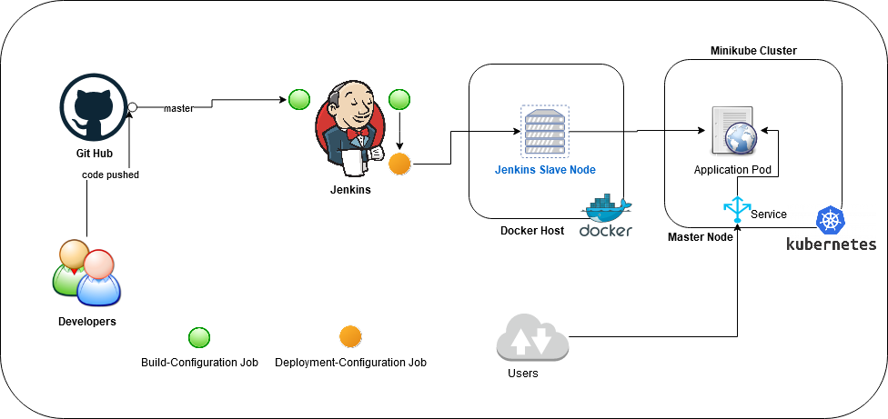
  <br>
  <em>Fig 1.: Project Flow  </em>
</p>


## Pre-requistes
- Docker-ce Server
- Jenkins Server

## Assumption
Both the servers are hosted in different VMs with Redhat Enterprise Linux 8 as Base Opertaing system 


## Scope of Project

1. Container Image for Jenkins Slave Node
2. Configure Cloud in Jenkins Server
3. Create chain Jobs with 

     - Job 1
     
          Create image with the latest code  and push it to repository
     
     - Job 2
	
          Rollout or create new application code


**Configure Docker Server**

   Jenkins dynamic slave node or cloud works on JNLP i.e Java Network Launch Protocol. It enables an application to be launched on a client desktop by using resources that are hosted on a remote web server. By default, the docker server exposes docker api to the  localhost only i.e docker command works only on the localhost. We need to configure Docker Server on which the Jenkins will launch its slave nodes to accept the remote docker api connections.
   
   We need to edit the docker server systemd service file. The docker server needs to be configured to accept the remote docker cli or api commands. We will be adding an extra port for docker daemon in `ExecStart` option in systemd service file. 
   
```
ExecStart=/usr/bin/dockerd -H fd:// -H tcp:0.0.0.0:5274
```
   
   `-H tcp:0.0.0.0:5274` => the parameter that has to be appended to the ExecStart Option
   
   The port number can be any number which is not being currently used in the host.

After configuration of the docker server, the server needs to be restarted i.e  `systemctl restart docker`. 
   
<p align="center">
  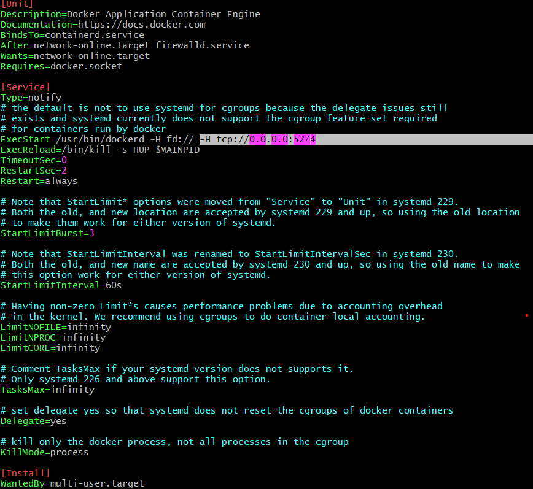
  <br>
  <em>Fig 2.: Docker Server Configuration  </em>
</p>


### Jenkins Slave Node Container Image

The container image for slave node needs to be ssh enabled for jenkins server to run jobs on it. The `alpine linux` base operating system is used keeping in mind to minimise the size of the image as much as possible. The two software packages that are must to be installed in image i.e
- Java
- Openssh

Command to install packages in `Alpine Linux`
```
apk add --no-cache --update openssh openjdk11
```

**Configuration of user**

The user with username `slave_node` is configured using `adduser` command with `jenkins` password.

```
adduser -D -h /home/slave_node --gecos "Jenkins Slave Node" slave_node &&\
echo "slave_node:jenkins" | chpasswd
```

**Download and configure kubectl**

To enable the slave node to launch kubernetes resources on Kubernetes Cluster, the kubectl is configured with authentication files i.e client.key,client.crt and ca.crt.

```
curl -LO https://storage.googleapis.com/kubernetes-release/release/`curl -s \
         https://storage.googleapis.com/kubernetes-release/release/stable.txt`/bin/linux/amd64/kubectl && \

chmod +x kubectl && \

mv kubectl /usr/bin
```

**Configure own Slave Node**

Anyone can make use of the image and copy the kuberenetes user credentials in the image and provide kubernetes cluster IP and file names. The `Dockerfile` extract needs to be : 

```
FROM riteshsoni296/kubectl:latest
COPY client.crt client.key ca.crt config.template /home/slave_node/.kube/
RUN chown -Rf slave_node.slave_node /home/slave_node/.kube
ENV KUBERNETES_CLUSTER_IP="192.168.99.101"
ENV CA_CERTIFICATE="ca.crt"
ENV CLIENT_CERTIFICATE="client.crt"
ENV CLIENT_KEY="client.key"

EXPOSE 22
RUN envsubst "`env | awk -F = '{printf " \\\\$%s", $1}'`" < /home/slave_node/.kube/config.template\
    > /home/slave_node/.kube/config

CMD ["/usr/sbin/sshd", "-D"]
```

The complete `Dockerfile` is present in the repository inside location `kubectl_node_config`.


## Configure Cloud in Jenkins Server

In Jenkins, there are two types of slave nodes that can be configured. They are

a. Static

b. Dynamic

In static slave node, the worker machine is connected to the jenkins server all the time even when there are not jobs to schedule. This sometimes leads to wastage of resoruces unnecessary.

So, dynamic node comes to rescue; which is only configured when there are available jobs for scheduling. As soon as the Job is completed, the node is destroyed.

### Pre-requisites
Plugins to be installed in Jenkins Server
- Docker Plugin


a. Click on `Manage Jenkins` on Left Column of Jenkins Landing Page

b. Click on `Manage Nodes and Clouds`

c. Click on `Configure Clouds`

<p align="center">
  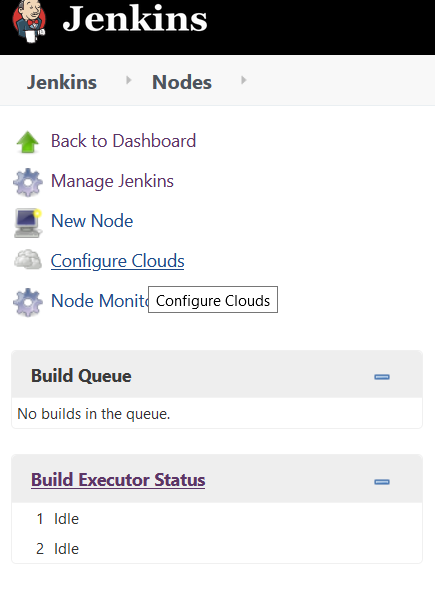
  <br>
  <em>Fig 3.: Configure Cloud  </em>
</p>

d. Select `Docker` from  `Add a New Cloud` dropdown

e. Provide Name for Slave Node like *kubectl_node*

f. Click on Docker Cloud Details

g. Provide Docker Server URL  

    For example:
        Docker Server IP                        : 192.168.99.105
        Port Configured on Docker Service  File : 5274
    
```
Docker Host URI : tcp://192.168.99.105:5274
```

<p align="center">
  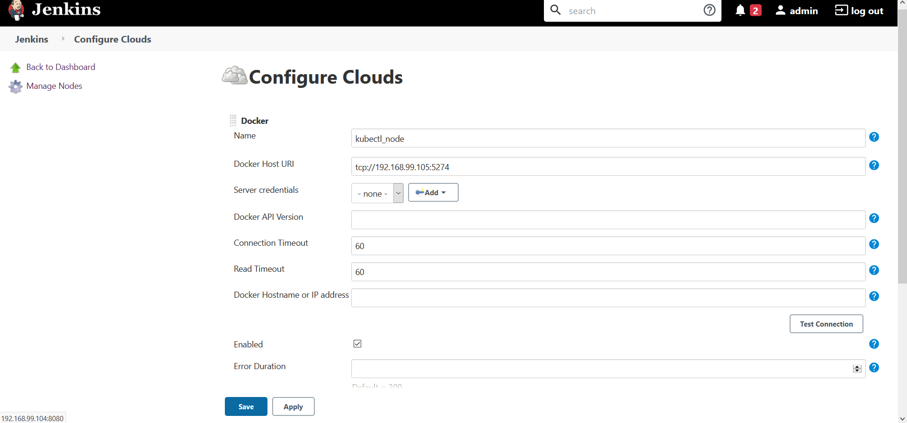
  <br>
  <em>Fig 3.: Configure Docker Server Details  </em>
</p>


h. After Configuration Click on `Test Connection` to verify the connectivity with the docker server.

i. Click on `Enabled` checkbox to enable this slave node configuration

j. Then click on `Docker Agent Templates` and then `Add Docker Template`

``` 
Labels                  : <any_label_for node>
Click on Enabled checkbox
Name                    : <any name for the node>
Docker Image            : <docker_image_for_slave_node>
Remote File System Root : <root__or_home_directory_of configured_user>
Connect Method          : Connect with SSH
    Select Use Configured SSH Credentials from `SSH Key` dropdown
    Click on Add in SSH Credentials option
        Provide Login details for the Container Image i.e username and password
    Host Key Verification Strategy: Non Verifying Verification Strategy

Pull Strategy            : Pull Once and Update Latest 
```

<p align="center">
  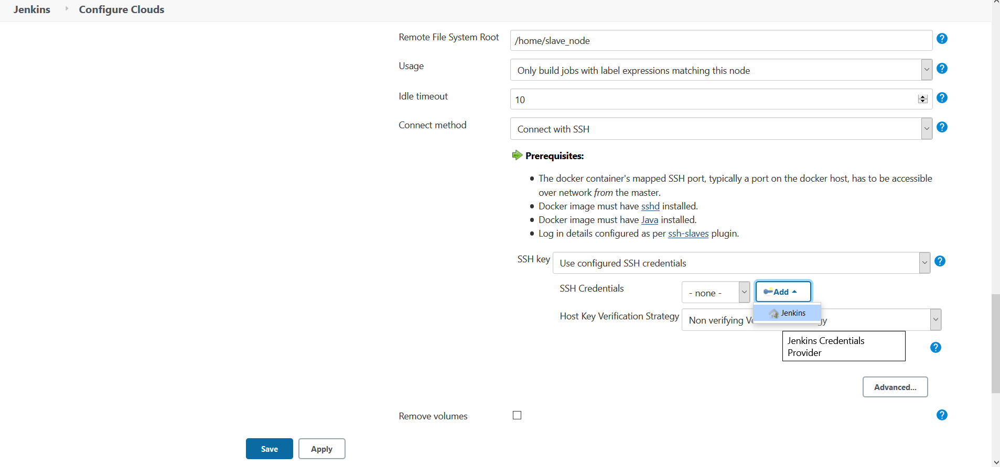
  <br>
  <em>Fig 4.: Configure Container Image Credentials  </em>
</p>


<p align="center">
  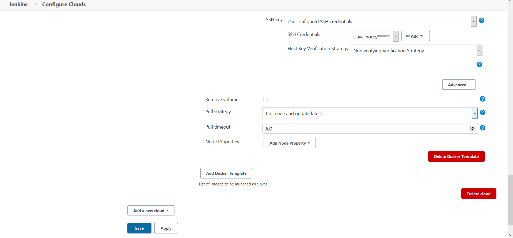
  <br>
  <em>Fig 5.: Configure Container Image Pull Strategy  </em>
</p>

k. Click on `Save and Apply`


## Trigger Deployment when changes are pushed to SCM

## Job 1: Build and Push Image due to SCM Changes

Steps to create Build-Configuration Job are as follows:

1. Create a New Item at the left column in Jenkins Welcome page

2. Configure Job Name

<p align="center">
  
  <br>
  <em>Fig 6.: Job Name Configuration  </em>
</p>

3. Configure github project URL

The **website code** that is used in this repository for *deployment* on EC2 web server [Github URL](https://github.com/riteshsoni10/demo_website.git)

4. Configure **Source Code Management** 

<p align="center">
  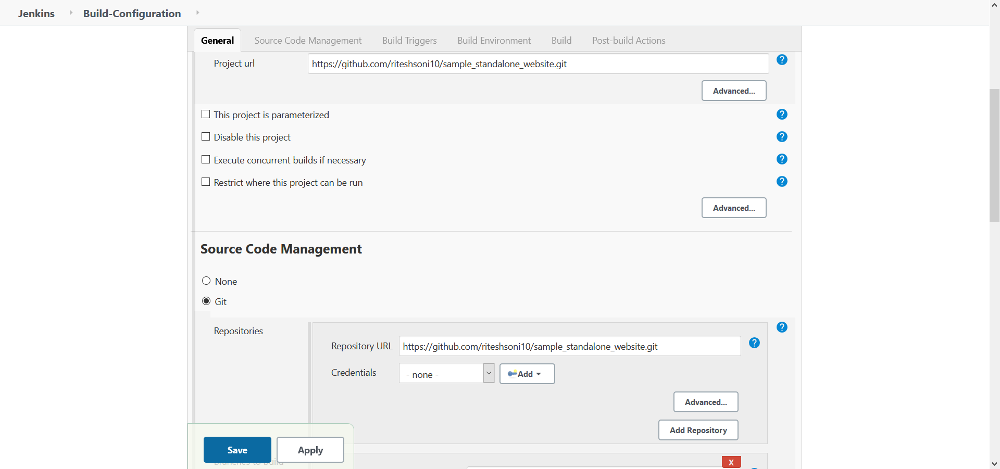
  <br>
  <em>Fig 7.: Source Code Management Configuration  </em>
</p>

5. Configure **Build Triggers**

The Job should be triggered only when any changes are pushed to the code repository. So we need to enable the checkbox near Poll SCM and configure the schedular to run at every minute by setting "* * * * * " value.

<p align="center">
  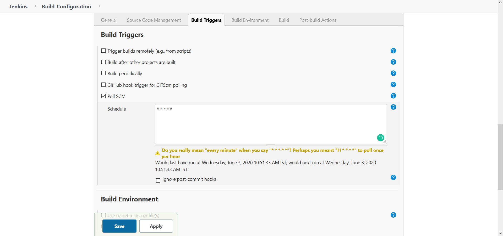
  <br>
  <em>Fig 7.: Configure Build Triggers  </em>
</p>

6. Steps to perform at **Build Stage**

Select `Build/Publish Docker Image` from `Add Build Step` dropdown.

```
Directory for Dockerfile : .
    > Here "." repersents current directory
Cloud : <label_donfigured_for_cloud>
Image: <image_name_to_be_pushed_in_docker_registry>
Enable `Push Image` checkbox
Registry Credentials:
    Click on Add
        And Provide Docker Hub Repository credentials to perform push operation 
```

<p align="center">
  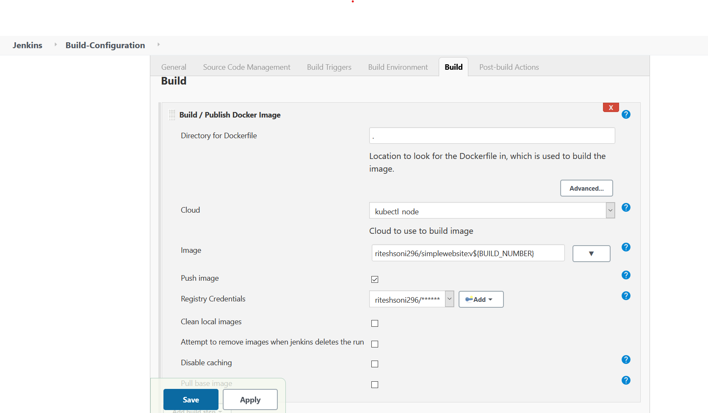
  <br>
  <em>Fig 8.: Build and Push Application Container Image  </em>
</p>


7. Save and Apply

<p align="center">
  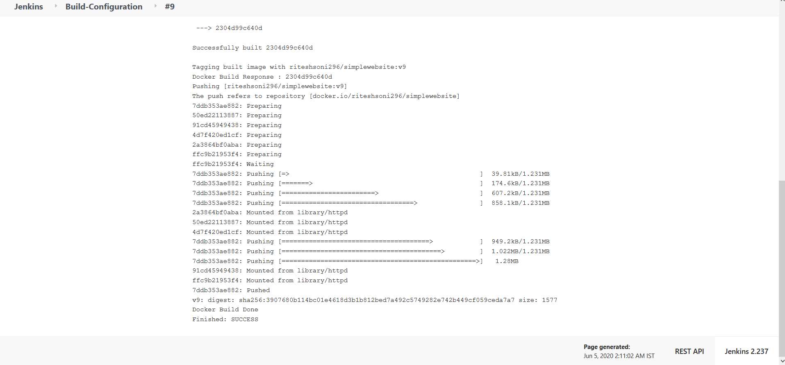
  <br>
  <em>Fig 9.: Job Console Output </em>
</p>


## Job 2: Rollout or Deploy New Application

Steps to create Build-Configuration Job are as follows:

1. Create a New Item at the left column in Jenkins Welcome page

2. Configure Job Name

3. Enable `Restrict Where This Project can be run`

```
Label Expression: <label_configured_of_cloud>
```

<p align="center">
  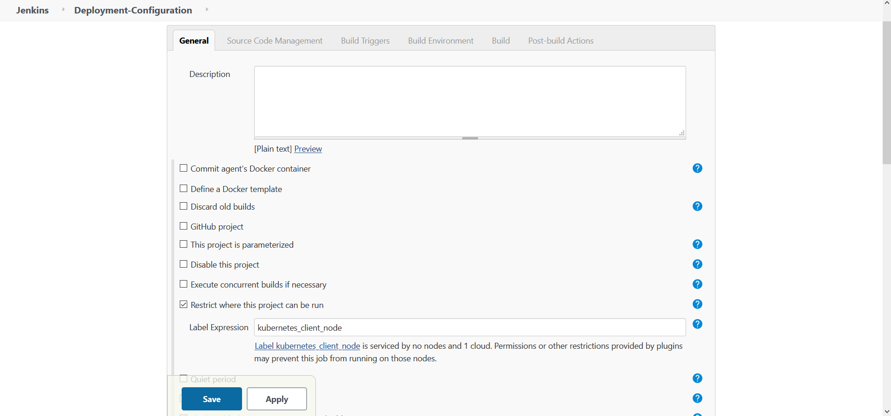
  <br>
  <em>Fig 10.: Job Environment Configuration </em>
</p>

4. Configure **Build Triggers**

Enable `Build After Other Projects are built` for Job Chaining.
```
Projects to watch: Build-Configuration
```
<p align="center">
  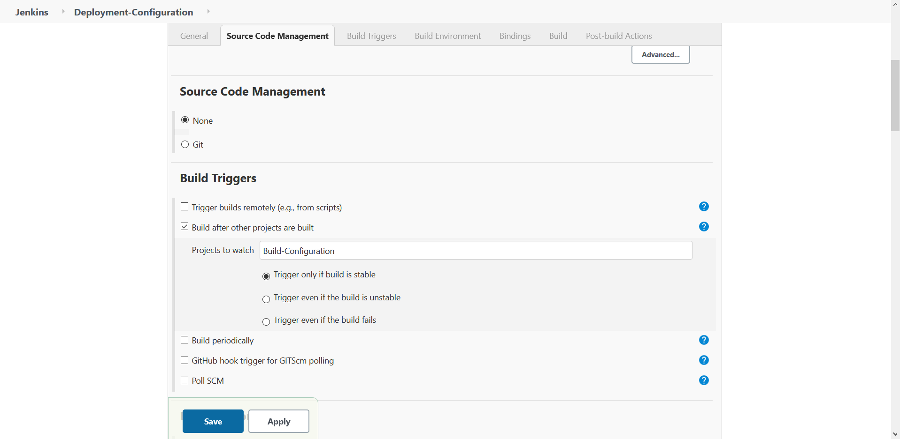
  <br>
  <em>Fig 11.: Build Trigger Configuration </em>
</p>

5. Steps to perform at **Build Stage**

Select `Execute Shell` from `Add Build Step` dropdown.
The script is present in `scripts` directory in this repository with name `deployment_configuration_job_build_stage.sh`. The contents of script needs to be copied in the build stage of the job.

<p align="center">
  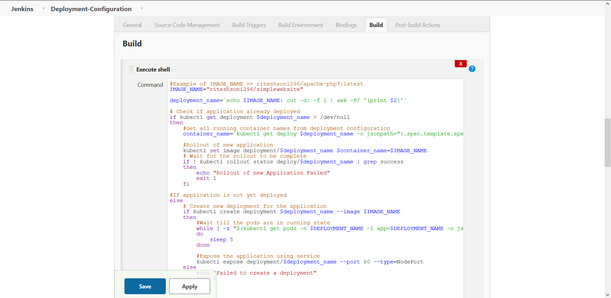
  <br>
  <em>Fig 12.: Build Stage Configuration </em>
</p>

6. Save and Apply


   
 > Source: LinuxWorld Informatics. Private Ltd.
 > 
 > Under Guidance of : Mr. [Vimal Daga](https://in.linkedin.com/in/vimaldaga)
